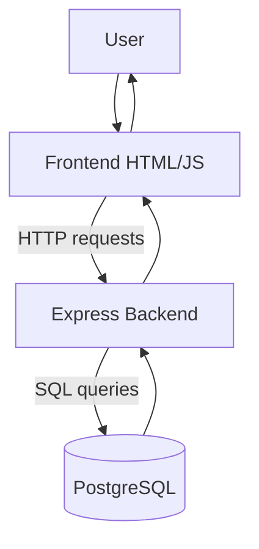

# Doorform

A simple job tracking application with a Node.js/Express backend and a vanilla
JavaScript frontend. Docker Compose is provided for running the full stack with
PostgreSQL.

## File Structure

```text
doorform/
├── backend/
│   ├── src/
│   │   ├── db.js          # PostgreSQL pool setup
│   │   ├── routes.js      # Express API routes
│   │   └── server.js      # Express app bootstrapper
│   ├── tests/             # Jest tests for the API
│   └── migrations.sql     # Database schema
├── frontend/
│   ├── index.html         # Main job interface
│   ├── data.html          # Admin utilities interface
│   ├── css/
│   └── js/
├── docker-compose.yml     # Development containers
```

## Process Workflow


